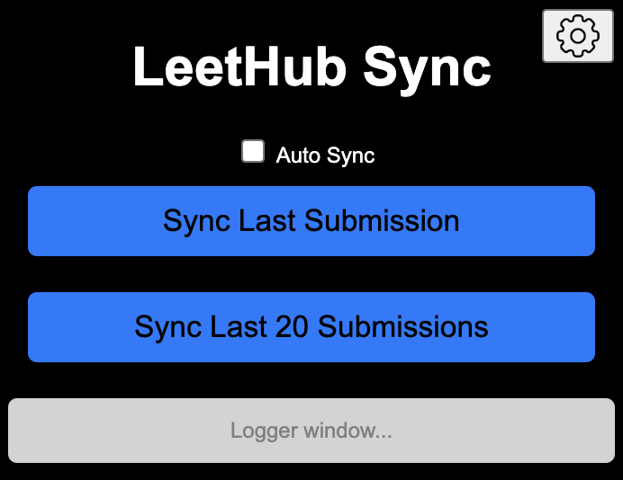

#  LeetHub Sync Chrome Extension




## Overview

**LeetHub Sync** is a Chrome extension that allows you to sync your LeetCode submissions to a specified GitHub repository. This extension simplifies the process of backing up your coding solutions by automating the retrieval and organization of your submissions.

## Features

- **Auto Sync:** Enable automated syncing upon each LeetCode submission.
- **Sync Last Submission:** Quickly sync the most recent submission to your GitHub repository.
- **Sync Last 20 Submissions:** Sync the last 20 submissions with a single click.
- **Customizable Settings:** Configure your GitHub Token and Repository URL via the settings page.
- **Automatic File Organization:** Submissions are saved to a 'submissions' directory and stored in sub folders based on the problem title, submission ID and programming language used.
- **Error Handling:** Clear and concise error messages to help you troubleshoot issues.

## Installation and Setup

1. **Install in Chrome Browser:**
- Navigate to the Chrome Web Store and search for [LeetHub Sync](https://chromewebstore.google.com/detail/leethub-sync/lgpbjdbepciblkallimlmjajfioghdde?hl=en-US&utm_source=ext_sidebar).
- Click the "Add to Chrome" button!
   

2. **Configure Settings:**
    - Click on the settings icon.
    - Login to Github and generate a [Github Token](https://github.com/settings/tokens).
    - Enter your GitHub Token and desired Github Repository URL in the settings modal.
    - Click "Update Configuration" to save your settings. <br>

## Usage

1. **Open the Extension:**
    - Click on the LeetHub Sync extension in your Chrome toolbar.
   
3. **Login to LeetCode:**
    - Navigate to the LeetCode website.
    - Ensure you are logged into your LeetCode account.
      
4. **Sync Submissions:**
    - Enable "Auto Sync" for automatic syncing when the LeetCode "submit" button is clicked!
    - Use the "Sync Last Submission" button to sync your latest LeetCode submission.
    - Use the "Sync Last 20 Submissions" button to sync your most recent 20 submissions.
 <br>
      
5. **View Status:** The popup will display success or error messages based on the sync status.

## Source Code File Structure

```plaintext
.
├── background
│   └── background.js
├── content
│   └── content.js
├── img
│   ├── lh_icon.png
│   ├── main_GUI.png
│   ├── settings_icon.png
│   └── settings_modal.png
└── popup
    ├── main.css
    ├── main.html
    └── popup.js
```

## RoadMap
Planned Features and Fixes

See [Milestones](https://github.com/calebcsimmons/LeetHub_Sync/milestones) for enhancements and bug fixes that are planned for the next release!

## Contributing
Want to contribute to LeetCode Sync? 

See the [CONTRIBUTING](.github/CONTRIBUTING.md) doc for instructions!
